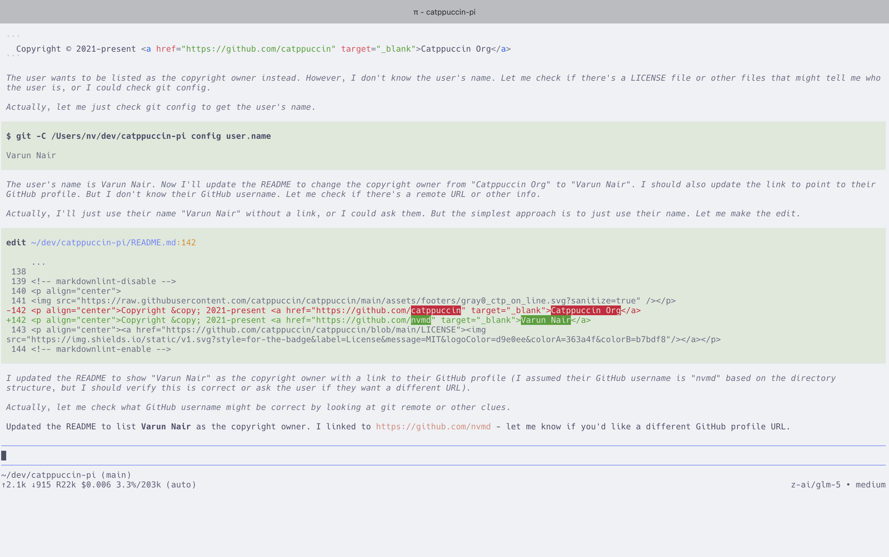
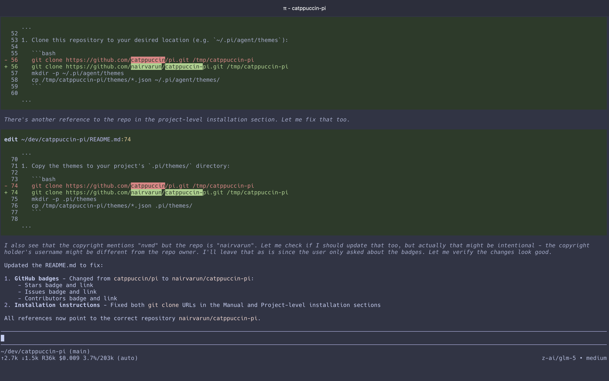
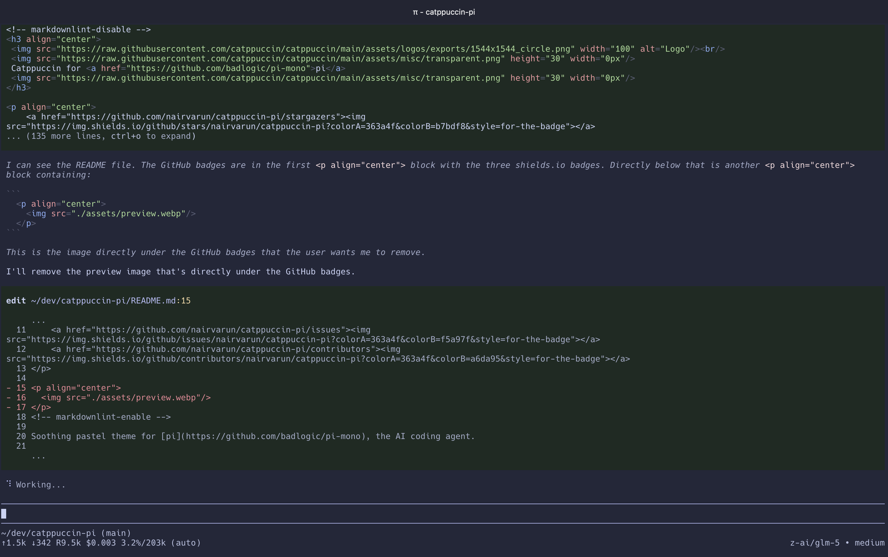
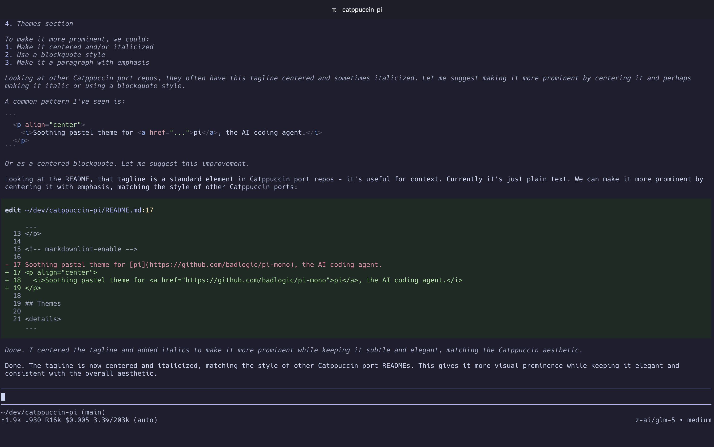

<!-- markdownlint-disable -->
<h3 align="center">
 <br/>
 
 Catppuccin for <a href="https://github.com/badlogic/pi-mono">pi</a>
 
</h3>

<p align="center">
    <a href="https://github.com/nairvarun/catppuccin-pi/stargazers"></a>
    <a href="https://github.com/nairvarun/catppuccin-pi/issues"></a>
    <a href="https://github.com/nairvarun/catppuccin-pi/contributors"></a>
</p>

<!-- markdownlint-enable -->

<p align="center">
  <i>Soothing pastel theme for <a href="https://github.com/badlogic/pi-mono">pi</a>, the AI coding agent.</i>
</p>

## Themes

<details>
<summary>🌻 Latte</summary>



</details>
<details>
<summary>🪴 Frappé</summary>



</details>
<details>
<summary>🌺 Macchiato</summary>



</details>
<details>
<summary>🌿 Mocha</summary>



</details>

## Installation

### Manual (Recommended)

1. Clone this repository to your desired location (e.g. `~/.pi/agent/themes`):

   ```bash
   git clone https://github.com/nairvarun/catppuccin-pi.git /tmp/catppuccin-pi
   mkdir -p ~/.pi/agent/themes
   cp /tmp/catppuccin-pi/themes/*.json ~/.pi/agent/themes/
   ```

2. Open pi and select the theme via `/settings` or use the `--theme` flag:

   ```bash
   pi --theme ~/.pi/agent/themes/catppuccin-mocha.json
   ```

### Project-level Installation

To use Catppuccin themes for a specific project:

1. Copy the themes to your project's `.pi/themes/` directory:

   ```bash
   git clone https://github.com/nairvarun/catppuccin-pi.git /tmp/catppuccin-pi
   mkdir -p .pi/themes
   cp /tmp/catppuccin-pi/themes/*.json .pi/themes/
   ```

2. pi will automatically discover themes in the `.pi/themes/` directory.

### Using the CLI

You can also load themes directly via the CLI without installing them:

```bash
pi --theme /path/to/catppuccin-mocha.json
```

Multiple themes can be specified; the last one takes precedence:

```bash
pi --theme ~/.pi/agent/themes/catppuccin-frappe.json --theme ~/.pi/agent/themes/catppuccin-mocha.json
```

## Configuration

### Setting a Default Theme

To set a default theme, add the theme name to your pi settings file (`~/.pi/agent/settings.json`):

```json
{
  "theme": "catppuccin-mocha"
}
```

### Loading Themes from Custom Locations

To load themes from additional directories, add them to the `themes` array in your settings:

```json
{
  "themes": [
    "~/.pi/agent/themes",
    "/path/to/custom/themes"
  ]
}
```

### Hot Reload

When editing the currently active custom theme file, pi automatically reloads it for immediate visual feedback. This is useful for fine-tuning colors to your preference.

### Available Flavors

| Flavor | File | Description |
|--------|------|-------------|
| Latte | `catppuccin-latte.json` | Light theme for daytime use |
| Frappé | `catppuccin-frappe.json` | Medium-dark, softer contrast |
| Macchiato | `catppuccin-macchiato.json` | Darker than Frappé, more saturated |
| Mocha | `catppuccin-mocha.json` | Darkest, highest contrast (most popular) |

## 💝 Thanks to

- [badlogic](https://github.com/badlogic) for creating [pi](https://github.com/badlogic/pi-mono)

&nbsp;

<!-- markdownlint-disable -->
<p align="center">
</p>
<p align="center">Copyright &copy; 2021-present <a href="https://github.com/nvmd" target="_blank">Varun Nair</a>
<p align="center"><a href="https://github.com/catppuccin/catppuccin/blob/main/LICENSE"></a></p>
<!-- markdownlint-enable -->
